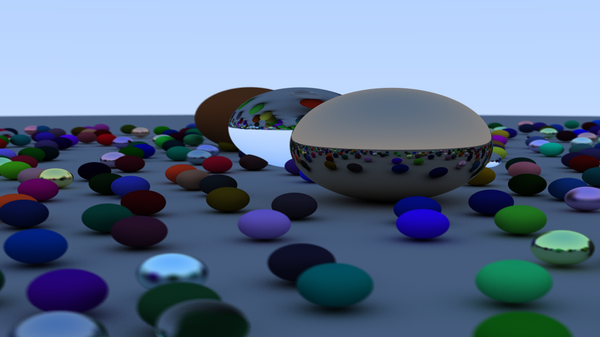

# Ray Tracing in CUDA

## Description

This project is a CUDA implementation of the ray tracer from the book *Ray Tracing in One Weekend* by Peter Shirley. The goal is to accelerate the rendering process by leveraging the parallel computing capabilities of GPUs.

## How to Run

To execute the ray tracer, simply run the following command:

```sh
build/Release/raytrace.exe > image.ppm
```

This will generate an output file named `image.ppm`, which contains the rendered image.

### Viewing the Image

Since `.ppm` files are not natively supported by many image viewers, you can use the following online viewer to open the generated image:

[PPM Viewer](https://www.cs.rhodes.edu/welshc/COMP141_F16/ppmReader.html)

## Progress

The project follows the 13 chapters of *Ray Tracing in One Weekend*. Below is a checklist of the completed chapters:

- [x] 1. Output an Image
- [x] 2. The vec3 Class
- [x] 3. Rays, a Simple Camera, and Background
- [x] 4. Adding a Sphere
- [x] 5. Surface Normals and Multiple Objects
- [x] 6. Antialiasing
- [x] 7. Diffuse Materials
- [ ] 8. Metal
- [ ] 9. Dielectrics
- [ ] 10. Positionable Camera
- [ ] 11. Defocus Blur
- [ ] 12. Bounding Volume Hierarchies
- [ ] 13. Final Render

## Current Render



This image represents the latest progress in rendering with CUDA, following the 10th chapter of the book.

## Future Improvements

- Implement depth of field with defocus blur (Chapter 11)
- Optimize performance using CUDA streams and memory optimizations
- Implement bounding volume hierarchies for faster object intersection tests
- Improve color accuracy and rendering quality

## Dependencies

- CUDA Toolkit
- A C++ compiler with CUDA support (e.g., NVCC)

## Author

This project is developed as an educational exercise in
